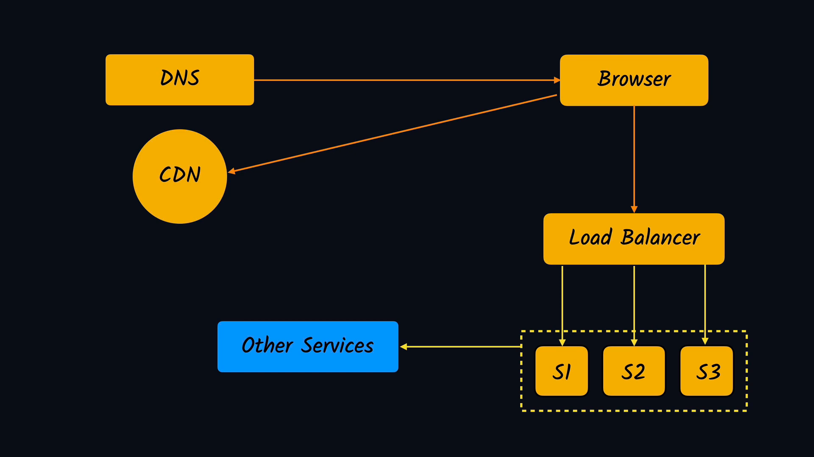
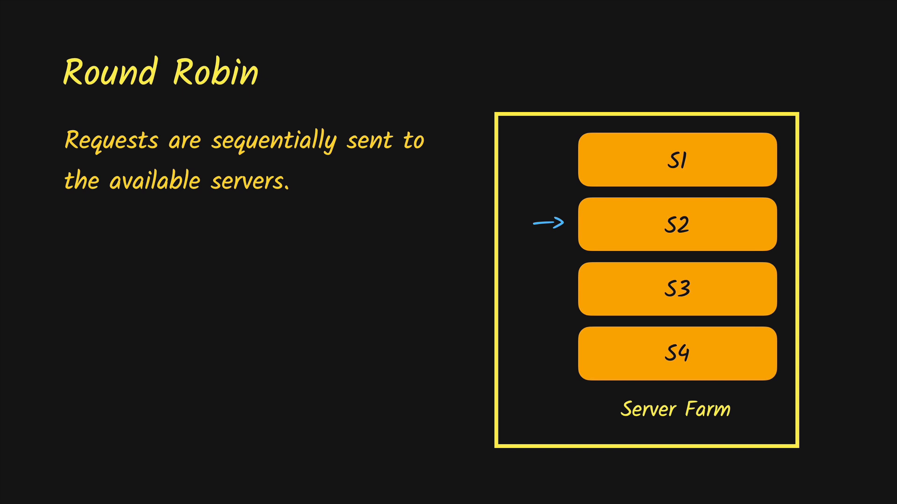
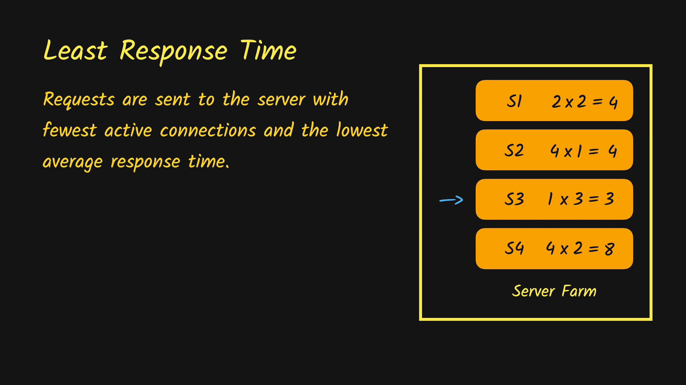

# System Design - Understanding The Internet

## Summary

- [System Design](#system-design)
- [Load Balancer](#load-balancer)
- [Content Delivery Networks (CDN)](#content-delivery-networks-(cdn))
- [Web Cash](#web-cash)
- [Content Delivery](#figure-4)
- [Content Delivery](#)
- [Content Delivery](#)

## **System Design**

To access a *website* the first thing that user will interact with is the browser. For example: the user want to open www.google.com, to access this site the browser needs to know where its located [figure 1](#figure-1) and to know where it's located it's used something called **DNS** (that is the responsible to tell where the website is located or where the website is on the Internet) [figure 2](#figure-2), when the browser gets the location websites from the DNS browser(the IP Address) it means that the browser knows where the applications server are, so it can make a call to the server and get back the web-page [figure 3](#figure-3), this web-page could came from the [*original server*](#server) or because of demand came from *cdn server* [figure 4](#figure-4).

###### **Figure 1**

###### **Figure 2**

###### **Figure 3**

###### **Figure 4**

### [On the Server Side](#server)

If we're receiving a high *load* of traffics per hour the server the resources might exhaust and we might have to increase the resources to support the large load of traffics. Supposing that our server have *500 Mb of RAM* and it's not allowed to support the traffic we need increase to *2 GB of RAM* to support the traffic, this process to increase the resources(such ram) is called _**Vertical Scaling**_ (but is not always recommend because the servers have limit and if the server go down, the applications go too). The other process is [_**Horizontal Scaling**_](#horizontal-scaling) (which means more server are handling our requests instead just one server)

#### Horizontal Scaling

Because of multiple server handling the requests we have to divide the traffic equally and this we have something called _**load balance**_, the *load balance* looks for which server are available and *distribute* the traffic equally.

And in modern applications architectures such micro-services or soap the might be several services that these servers are talking(as services for authentication, registration, emails and so on) communication with these APIs are made with Restful API or DRPC or with the help of messages queues.

Next we have Storage, there might be different kinds of storage that an application might be using such (*database, cashing* and *cloud storage*).

## **Load Balancer**

As we know if have a large number of loads or request at same time, our [server might exhaust](#exhausted-server), so we could do [**horizontal scale**](#horizontal-scaling) increasing the number of servers to perform ours requests, we call these servers [**server farm**](#server-farm), so, when we do this, we will need something to control the requests flow, for that we use **load balancer** (Load Balancers helps you scale your application to support a large number of users). 

###### **Exhausted server**

###### **Server Farm**

The **load balancer** get request to the client then distribute to the available server. The good thing about load balancer is that we could add more and more servers to handle more *loads* and also if one of the [servers goes down](#servers-goes-down) the load balancer register this server and distribute the traffic between the rest of available servers.

###### **Load balancer**

###### **Servers goes down**

### Types of Load Balancers

#### Hardware Load Balancer 

Are more expensive and harder to maintain.

#### Software Load Balancer

They're more cheapest and most used

### Load Balancing Algorithms 

The Load Balancer is related with OSI 

## **Content Delivery Networks (CDN)**

When we *DEPLOY* a web application, we pick a location where the server is going to be placed (example: AWS, Digital Ocean), All those servers have *one location* but the *clients* might be all around the world. When the clients opens a *website* far from servers location the request become slower to get the response and as far apart from the server the client makes the request, the response will take more and more time, this issue to support this is **high latency**(The web pages become slower for the people who are far apart from our server). **Load on the server**(Are the load who will going to be on our server because we are hoisting all the content and when the number of client increase, there going to be more and more loads on our server) and **Security** (Because we are getting request, it means that we are more vulnerable to the *secure issues*).

#### *Faced Issues*

- **high latency**

- **load on the server**
- **security**

#### *What's the solution?*

The fix is to use **CDN - Content Delivery Network**, which simply we are caching the web content at multiple geographical locations

### CDN - Content Delivery Networks

With *CDN* we are caching the web content at multiple geographical locations. This means that we will have multiple server located at different positions, and the client access the web-page from the server near him. 

#### *How the server get the data?*

They're two ways *push strategy* and *pull strategy* 

- In the **Push strategy** when we deploy an application, we push the content to all our *cdn servers* and when the client try to access the website, it make the request to cdn server near from him, it founds the content there without going to th *original server*
- In the **Pull strategy** we steal deploy the application, but when the clients access the website to the *cdn server* it will check in cache if the content is there and if not the cdn make the request to original server and get the content and store the content to cache, when the a clients try to access the website again the content will be there and the request will be made from cdn.

#### *How the info will be updated?*

The answer to this question is *http caching headers*

## **Web Cash**

